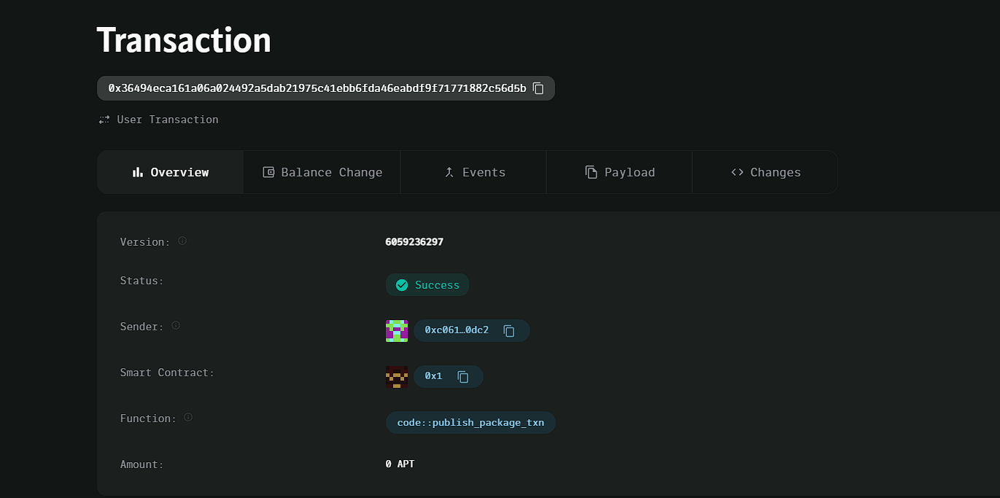

### Deployed smartcontract address: 0x36494eca161a06a024492a5dab21975c41ebb6fda46eabdf9f71771882c56d5b

### Screenshot: 

# Decentralized Task Board

## Project Description
The **Decentralized Task Board** is a project management system built on the Aptos blockchain. It allows users to create tasks, assign rewards, and enable task completers to claim rewards upon completion. The contract ensures a decentralized, secure, and transparent way to manage tasks and distribute rewards without intermediaries.

## Vision
Our vision is to create a decentralized task management platform where users can collaborate, create, and complete tasks with automated and transparent reward distribution. This smart contract provides the foundation for users to build trustless task boards for various purposes, from freelance gigs to community-managed tasks.

## Key Features
- **Create Tasks**: Users can create tasks with a specified reward in AptosCoin.
- **Task Completion**: Task completers can mark tasks as complete and claim rewards upon completion.
- **Reward Distribution**: The reward is automatically distributed to the task completer once the task is completed.

## Future Scope
- **Task Assignment**: Future iterations will allow users to assign specific individuals or groups to tasks.
- **Task Expiry**: Add a deadline for tasks, allowing rewards to expire after a certain period.
- **Task Escrow**: Implement an escrow mechanism to hold rewards securely until task verification.
- **Task Bidding**: Allow users to bid for tasks, with rewards set dynamically based on competitive bids.
- **Task Categories**: Categorize tasks based on different project types or industries.
